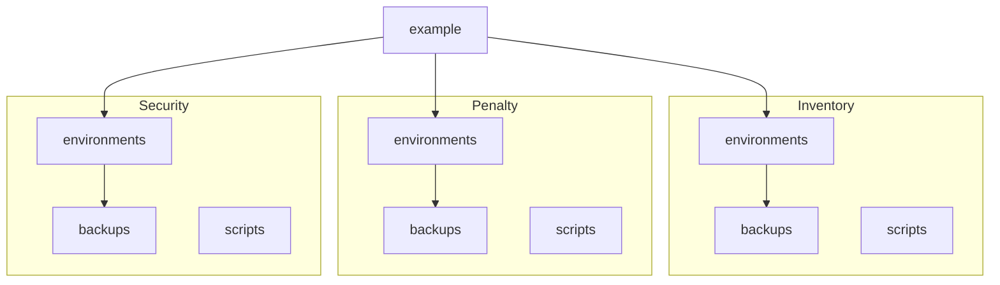

```mermaid
graph TD
    subgraph Inventory
        I1[environments]
        I2[backups]
        I3[scripts]
    end
    subgraph Penalty
        P1[environments]
        P2[backups]
        P3[scripts]
    end
    subgraph Security
        S1[environments]
        S2[backups]
        S3[scripts]
    end
    Example[example]
    I1 --> I2
    P1 --> P2
    S1 --> S2
    Example --> I1
    Example --> P1
    Example --> S1
```
